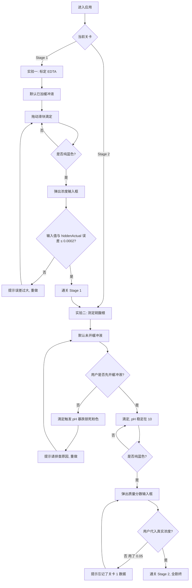

# PRD：滴定系统遥测与失效模拟器 (Titration System Failure Simulator)

> **Author**：楼楼大王
> **文档版本**：v1.0（基于原始需求 + 调研优化）
> **目标用户**：化学实验初学者 / 复盘实验失败原因的学生 / 化学教学演示场景

---

## 1. 产品概述

本产品是一款单页 Web 应用（SPA），通过"高精度生物遥测仪表盘"的视觉隐喻，把 EDTA 络合滴定实验中"缓冲溶液失效 → pH 崩溃 → 铬黑 T 指示剂锁死"这一真实物理过程，转化为可被普通用户拖动滑块即时观察、可被踩坑、可被"通关"的交互式教学模拟器。区别于一般化学课件的静态截图，本产品的核心价值在于用一台"工业遥测机"的皮肤，让用户在两轮闯关中亲自制造、观察、并反思三次真实实验中最常见的失败模式。

---

## 2. 核心功能

### 2.1 用户角色

本应用为单机模拟器，无登录、无后端、无多人协作，因此不区分角色。

### 2.2 功能模块

应用采用"双关卡 + 单页状态切换"结构，主要模块如下：

1. **顶层引导面板（Onboarding Banner）**：始终置顶，显示当前关卡目标与教学提示。
2. **左侧控制台（Control Panel）**
   - 主控开关：氨-氯化铵缓冲溶液开关（仅关卡 2 显示）。
   - 滴定执行器：体积滑块（0.00 ~ 30.00 mL，步长 0.10 mL）+ "+半滴 (0.05 mL)"微调按钮。
   - 系统归零：重置当前关卡到初始状态。
3. **中部视觉反馈区（Visual Feedback）**
   - SVG 锥形瓶视窗：液面颜色绑定全局 `color` 状态。
   - 大字号状态文本：根据当前物理状态输出"未到达终点 / 系统已死锁 / 滴定成功 / 实验失败：过量 / 终点误差过大"等。
4. **右侧遥测仪表盘（Telemetry Dashboard）**
   - 核心指标卡：实时 pH 值（保留 2 位小数）+ 已消耗 EDTA 体积。
   - pH 跌落监控折线图（Recharts）：X 轴为体积，Y 轴为 pH (0–14)，含 pH=6.5 警示红线。
   - 关卡专属面板：
     - 关卡 1：浓度计算校验弹窗。
     - 关卡 2：缓冲液状态指示 + 质量分数计算校验弹窗。
5. **关卡进度条（Stage Progress）**：显示当前处于"实验一标定"还是"实验二测定"，以及是否已通关。
6. **结算/通关弹层（Result Modal）**：通关时显示教育性文案（"你做对了什么"），失败时显示对应原因与"重做"按钮。

### 2.3 页面详情

| 页面/视图 | 模块名 | 功能描述 |
|-----------|--------|---------|
| 主界面 | Onboarding Banner | 展示当前关卡名称、目标、提示语，可关闭 |
| 主界面 | Control Panel | 滑块、开关、按钮的工业风遥测控制区 |
| 主界面 | Flask Visual | SVG 锥形瓶，液体颜色实时变化，瓶口有滴定管伸出 |
| 主界面 | Telemetry Cards | 大字号 pH / Volume 数值，配 LED 风格指示灯 |
| 主界面 | pH Chart | Recharts 折线图，含 6.5 红线 ReferenceLine |
| 主界面 | Stage 1 Input | 标定完成后弹出 EDTA 真实浓度输入框（4 位小数） |
| 主界面 | Stage 2 Input | 滴定成功后弹出质量分数计算输入框 |
| 弹层 | Success Modal | 通关庆祝 + 教育性反思文案 |
| 弹层 | Failure Modal | 失败原因说明 + 重做按钮 |

---

## 3. 核心流程

### 3.1 整体流程（Mermaid）



### 3.2 关键交互节点说明

- **Stage 1 末端微调**：当 `volume` 进入 [19.5, 20.5) 区间时，0.10 步长的主滑块**视觉变灰**，强制用户使用 "+半滴" 按钮（0.05 mL 步长）。如直接拖主滑块跨过 20.5 mL → 判定"过量滴定，深蓝色"，失败。
- **Stage 2 缓冲液死锁**：当 `bufferEnabled === false` 且 `volume > 0` 时，pH 立即按公式跌至 < 6.5，颜色 Override 为亮粉红，状态文本切到"系统已死锁"，且**禁止**继续滴定（必须重置或先开缓冲液）。
- **Stage 2 浓度陷阱**：滴定成功后弹窗里**显眼地**显示"已知 EDTA 理论浓度为 0.05 mol/L"提示语，引导用户犯错；当用户提交 0.05 时，提示"你忘了关卡 1 辛苦标定的真实浓度了吗？"，要求重输。

---

## 4. 用户界面设计

### 4.1 设计风格

- **整体气质**：高精度生物遥测仪器 / 工业 SCADA 控制台 / 深色仪表盘。
- **配色系统**（CSS 变量）：
  - 背景底色：`#070A12`（近黑带蓝）
  - 面板背景：`#0F1524` + `rgba(255,255,255,0.04)` 玻璃质感
  - 主强调色（指示剂蓝）：`#4DD0E1`（铬黑 T 终点蓝）
  - 次强调色（酒红→紫→蓝渐变）：`#C2185B → #8E24AA → #1976D2`
  - 警示色（pH 红线 / 死锁粉）：`#FF2D75`（亮粉红）
  - 成功色：`#00E676`（LED 绿）
  - 文本主色：`#E8ECF4`、次色：`#7A8AA8`、禁用灰：`#3B475C`
- **按钮 / 控件**：
  - 主开关：拟物拨杆（toggle switch），带 LED 指示灯（灭/亮）。
  - 滑块：带刻度线和拖动时的发光描边。
  - 按钮：方角、带 1px 边框、内阴影 + 外发光。
- **字体**：
  - 显示字体（数字 / 标题）：`JetBrains Mono` 或 `Space Mono`（等宽遥测风）。
  - 正文字体：`IBM Plex Sans` 或 `Inter Tight`。
  - 中文回退：`PingFang SC`, `Noto Sans SC`。
- **布局风格**：12 栅格 + 三栏（左控制 / 中视觉 / 右仪表），面板间距 16 px，圆角 4 px（工业感的极小圆角）。
- **图标**：使用 `lucide-react`，保持线性、单色、1.5px 描边风格。

### 4.2 页面设计概览

| 视图 | 模块 | UI 元素 |
|------|------|---------|
| 顶部 | Stage Progress + Onboarding | 横向 stage 指示器，1/2 已通关后亮 LED 绿；右侧关闭按钮 |
| 左栏 | Control Panel | 顶部 toggle / 中部 slider + 微调按钮 / 底部 reset；面板底部有"系统状态：NORMAL / WARNING / LOCKED"指示 |
| 中栏 | Flask Visual + 状态文本 | 上方滴定管 SVG（带液滴动画），中部锥形瓶（液体填充颜色 + 体积刻度），下方 24px 状态文本 |
| 右栏 | Telemetry Cards | 两张并排大数字卡片，下方 400px 高度的折线图 |
| 弹层 | Input Modal / Result Modal | 居中模态，背景模糊，输入框 mono 字体，下方操作按钮组 |

### 4.3 响应式策略

- **首选桌面端（≥1280px）**：三栏并排。
- **平板（768–1279px）**：保持三栏，但中栏烧瓶缩小至 240px。
- **移动端（<768px）**：单列堆叠，控制 → 烧瓶 → 仪表。但因涉及滑块精度，移动端仅做基本可用性，不做精细优化。

### 4.4 动效 / 微交互

- 锥形瓶颜色变化：CSS `transition: background-color 300ms ease`。
- 滴定管液滴：滴定时 SVG `animate` 一滴液体从管口落下（300ms）。
- 数值变化：pH / Volume 数字滚动（`requestAnimationFrame` 平滑过渡 200ms）。
- 折线图：新数据点用 `dot` 描红闪烁两次（`animate-pulse`）。
- 状态文本切换：旧文本向上淡出 + 新文本从下淡入（200ms）。
- 重置：所有面板快速闪烁一次白色描边（"系统重启"反馈）。

---

## 5. 核心物理引擎（状态计算函数）

> 本节为实现时的**权威真值**，开发必须严格按此公式落地。

### 5.1 全局状态

```ts
type Stage = 1 | 2;
type StatusText =
  | 'STANDBY' | 'TITRATING' | 'NEAR_ENDPOINT'
  | 'STAGE_1_OVERSHOT' | 'STAGE_1_SUCCESS' | 'STAGE_1_CALC_INPUT'
  | 'STAGE_2_PINK_LOCK' | 'STAGE_2_NEED_BUFFER' | 'STAGE_2_SUCCESS'
  | 'STAGE_2_CALC_INPUT' | 'STAGE_2_WRONG_CONC' | 'ALL_CLEAR';

interface SimState {
  stage: Stage;                       // 当前关卡
  volume: number;                     // 0.00 ~ 30.00 mL
  bufferEnabled: boolean;             // 缓冲液开关（仅 Stage 2）
  pH: number;                         // 0 ~ 14
  color: string;                      // HEX
  status: StatusText;                 // 状态文本
  hiddenActualConc: number;           // 0.0450 ~ 0.0650（启动时随机一次）
  history: { volume: number; pH: number; color: string }[]; // 折线图数据
}
```

### 5.2 pH 计算（权威公式）

```
if (bufferEnabled) {
  pH = 10.0;                                      // 缓冲液开 → 死死锁定
} else if (volume <= 0) {
  pH = 7.0;
} else {
  pH = Math.max(3.5, 7.0 - Math.log10(volume * 10 + 1) * 2.5);
}
```

> 优化点：原需求用 `*2`，会让 pH 跌到 ~5.4 才过红线；改用 `*2.5`，可在 volume≈0.4 mL 时即跌破 6.5，戏剧性更强。

### 5.3 颜色计算（Override 优先级）

```
if (bufferEnabled) {
  // 理想路径
  if (volume < 19.5)        color = WINE_RED   // #B0152A
  else if (volume < 20.0)   color = PURPLE     // #7B2D8E
  else                      color = CLEAR_BLUE // #1976D2
} else {
  // 失效路径（pH 优先级最高）
  if (pH < 6.5)             color = HOT_PINK   // #FF2D75  ← 锁死
  else if (volume < 20.0)   color = WINE_RED
  else                      color = CLEAR_BLUE  // 理论上走不到这里
}
```

### 5.4 Stage 1 / Stage 2 判定

- **Stage 1**：bufferEnabled 永远为 `true`（UI 隐藏开关）。体积区间 [19.5, 20.5) 启用"半滴微调"。`volume >= 20.5` 判定 OVERSHOT。
- **Stage 2**：bufferEnabled 由用户控制。bufferEnabled=false 且 pH<6.5 → 强制 LOCK，体积滑块冻结。

---

## 6. 验收标准（Definition of Done）

1. ✅ 三栏布局在 1280px+ 桌面端完整呈现，无横向滚动。
2. ✅ Stage 1 拖动滑块到 ≥ 20.5 mL 显示"过量"并要求重做。
3. ✅ Stage 1 在 [19.5, 20.5) 区间主滑块步长禁用，需用 0.05 mL 按钮。
4. ✅ Stage 1 输入隐藏浓度误差 ≤ 0.0002 才进入 Stage 2。
5. ✅ Stage 2 未开缓冲液时滴定一定锁死粉色，无法通关。
6. ✅ Stage 2 开了缓冲液后 pH 恒为 10.00，颜色按 19.5/20.0 节点变化。
7. ✅ Stage 2 用 0.05 mol/L 计算时被识别为错误，提示要代入真实浓度。
8. ✅ Recharts 折线图清晰显示当前滴定轨迹 + pH=6.5 红线 + pH=10 水平线（缓冲液开时）。
9. ✅ 深色工业遥测风视觉到位，pH/Volume 数字等宽且有节奏感。
10. ✅ 移动端基本可用，无 JS 报错。