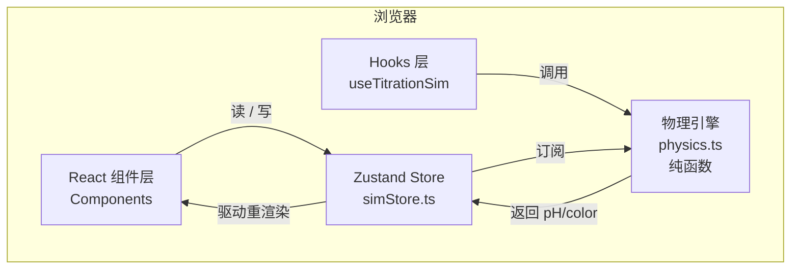
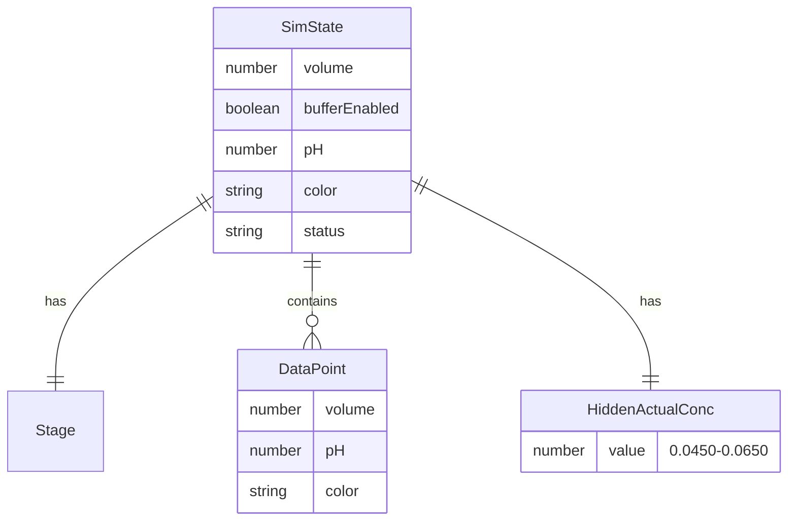

# 技术架构文档：滴定系统遥测与失效模拟器

> **版本**：v1.0
> **配套文档**：[PRD.md](./PRD.md)

---

## 1. 架构设计

本应用为**纯前端单页应用（SPA）**，无后端、无数据库、无外部服务。所有状态、随机数、物理引擎均在浏览器内运行。



**关键设计原则**：
- **物理引擎纯函数化**：`computePH` / `computeColor` / `judgeStage` 均为纯函数，便于单元测试和调试。
- **状态与 UI 解耦**：所有业务状态集中在 zustand store，组件仅做受控展示与事件派发。
- **无副作用组件**：滑块、烧瓶、图表均为纯展示组件。

---

## 2. 技术栈描述

| 类别 | 选型 | 版本 | 用途 |
|------|------|------|------|
| 构建工具 | **Vite** | 5.x | 极速 HMR、零配置 |
| 框架 | **React** | 18.x | UI 框架 |
| 语言 | **TypeScript** | 5.x | 类型安全 |
| 路由 | **react-router-dom** | 6.x | 仅保留 `/` 单路由（SPA） |
| 样式 | **Tailwind CSS** | 3.x | 设计 token / 原子化样式 |
| 状态管理 | **zustand** | 4.x | 轻量 store |
| 图表 | **Recharts** | 2.x | pH 折线图 |
| 图标 | **lucide-react** | latest | 线性图标 |

**对原 PRD 的偏离说明**：原 PRD 建议 Next.js，但本应用为纯前端 SPA，无需 SSR / API Routes，Vite + React 的开发与构建体验更轻、更快、产物更小，因此采用 Vite。CSS 方案维持 Tailwind。

---

## 3. 目录结构

```
.
├── .trae/documents/
│   ├── PRD.md
│   └── TECH_ARCH.md
├── public/
│   └── fonts/                     （可选，字体本地化）
├── src/
│   ├── components/
│   │   ├── ControlPanel.tsx       左侧控制台
│   │   ├── FlaskVisual.tsx        SVG 锥形瓶
│   │   ├── Burette.tsx            滴定管 SVG（液滴动画）
│   │   ├── StatusText.tsx         中部大字号状态
│   │   ├── TelemetryCards.tsx     右侧指标卡
│   │   ├── PHChart.tsx            Recharts 折线图
│   │   ├── StageProgress.tsx      顶部关卡指示
│   │   ├── OnboardingBanner.tsx   教学提示
│   │   ├── ToggleSwitch.tsx       拟物拨杆
│   │   ├── Slider.tsx             自定义滑块（带半步禁用态）
│   │   └── modals/
│   │       ├── Stage1InputModal.tsx
│   │       ├── Stage2InputModal.tsx
│   │       └── ResultModal.tsx
│   ├── hooks/
│   │   └── useTitrationSim.ts     编排 store + engine 调用
│   ├── pages/
│   │   └── Simulator.tsx          主页面（三栏装配）
│   ├── store/
│   │   └── simStore.ts            zustand 全局状态
│   ├── engine/
│   │   ├── physics.ts             pH / color 纯函数
│   │   ├── stages.ts              关卡判定逻辑
│   │   └── random.ts              启动时随机浓度生成
│   ├── types/
│   │   └── index.ts               类型定义
│   ├── utils/
│   │   ├── format.ts              数字 / 颜色格式化
│   │   └── colors.ts              颜色常量与过渡插值
│   ├── styles/
│   │   └── globals.css            Tailwind 入口 + CSS 变量
│   ├── App.tsx
│   └── main.tsx
├── index.html
├── package.json
├── tailwind.config.js
├── postcss.config.js
├── tsconfig.json
└── vite.config.ts
```

---

## 4. 路由定义

| 路由 | 用途 |
|------|------|
| `/` | 模拟器主界面（唯一路由） |
| `*` | 重定向至 `/` |

> 单路由设计，无嵌套路由。

---

## 5. 核心模块接口

### 5.1 物理引擎 `engine/physics.ts`

```ts
export const WINE_RED    = '#B0152A';
export const PURPLE      = '#7B2D8E';
export const CLEAR_BLUE  = '#1976D2';
export const HOT_PINK    = '#FF2D75';

/** 根据 bufferEnabled + volume 计算 pH */
export function computePH(volume: number, bufferEnabled: boolean): number;

/** 根据 bufferEnabled + volume + pH 计算 HEX 颜色（pH 优先级最高） */
export function computeColor(volume: number, bufferEnabled: boolean, pH: number): string;

/** 根据当前状态生成状态文本 */
export function judgeStatus(state: SimState): StatusText;
```

### 5.2 关卡逻辑 `engine/stages.ts`

```ts
/** Stage 1: 标定 - 判断是否过量 */
export function isStage1Overshot(volume: number): boolean;

/** Stage 1: 判断是否需要进入半滴微调 */
export function isStage1NearEndpoint(volume: number): boolean;

/** Stage 1: 校验用户输入的浓度 */
export function validateStage1Input(input: string, actual: number): { ok: boolean; diff: number };

/** Stage 2: 判断是否进入粉色死锁 */
export function isStage2PinkLock(pH: number, bufferEnabled: boolean): boolean;

/** Stage 2: 校验用户输入的质量分数（要求用真实浓度） */
export function validateStage2Input(
  input: string,
  usedConcentration: number,
  actual: number
): { ok: boolean; reason?: 'used_theoretical' | 'wrong_value' };
```

### 5.3 Store `store/simStore.ts`（zustand）

```ts
interface SimStore {
  // 状态
  stage: Stage;
  volume: number;
  bufferEnabled: boolean;
  pH: number;
  color: string;
  status: StatusText;
  history: DataPoint[];
  hiddenActualConc: number;
  stage1Cleared: boolean;
  stage2Cleared: boolean;

  // 行为
  init: () => void;
  setVolume: (v: number) => void;
  addDrop: () => void;             // +0.05 mL
  toggleBuffer: () => void;
  reset: () => void;
  submitStage1: (input: string) => ValidationResult;
  submitStage2: (input: string) => ValidationResult;
}
```

---

## 6. 数据模型

本应用为无后端单页应用，**所有数据为运行时内存数据**，无持久化、无数据库。下表说明主要"数据实体"的内存结构：

### 6.1 实体定义（Mermaid ER）



### 6.2 内存初始化（伪 DDL）

```ts
// 启动时执行一次
hiddenActualConc = round(0.0450 + Math.random() * 0.0200, 4);  // 例：0.0593
volume = 0.0;
bufferEnabled = (stage === 1);    // Stage 1 默认开，Stage 2 默认关
history = [{ volume: 0, pH: 7, color: WINE_RED }];
```

---

## 7. 视觉系统（设计 Token）

`tailwind.config.js` 中扩展：

```js
colors: {
  ink:       { 950: '#070A12', 900: '#0F1524', 800: '#161D33' },
  led:       { blue: '#4DD0E1', green: '#00E676', pink: '#FF2D75', red: '#FF5252' },
  indicator: { wine: '#B0152A', purple: '#7B2D8E', blue: '#1976D2', pink: '#FF2D75' },
  text:      { primary: '#E8ECF4', secondary: '#7A8AA8', disabled: '#3B475C' }
},
fontFamily: {
  mono: ['"JetBrains Mono"', '"Space Mono"', 'ui-monospace', 'monospace'],
  sans: ['"IBM Plex Sans"', '"Inter Tight"', '"PingFang SC"', '"Noto Sans SC"', 'sans-serif']
}
```

---

## 8. 性能与质量

- **构建产物**：gzip 后 ≤ 300 KB（仅首屏必要 chunk）。
- **HMR**：< 200 ms。
- **TypeScript 严格模式**：`strict: true`，禁用 any。
- **组件粒度**：单组件 ≤ 200 行；超长拆分子组件 / hooks。
- **物理引擎纯函数**：可通过 `vitest` 单元测试（可选，本次不写测试）。

---

## 9. 部署

- 静态站点，可部署到 Vercel / Netlify / GitHub Pages。
- `pnpm build` 产物输出至 `dist/`，可直接托管。
- 根路径相对资源（`base: './'`），便于子路径托管。

---

## 10. 开发里程碑

1. **脚手架**：Vite + React + TS + Tailwind + 依赖安装。
2. **物理引擎 + Store**：纯函数 + zustand 单测可行。
3. **三栏 UI 骨架**：布局到位，无业务逻辑。
4. **Stage 1 闭环**：滑块 → 烧瓶 → 输入校验 → 跳转。
5. **Stage 2 闭环**：缓冲液开关 → 死锁检测 → 浓度陷阱。
6. **Recharts 集成 + 动效精修**：折线图、滴定管液滴动画、数字滚动。
7. **整体视觉打磨 + dev server 验证**。